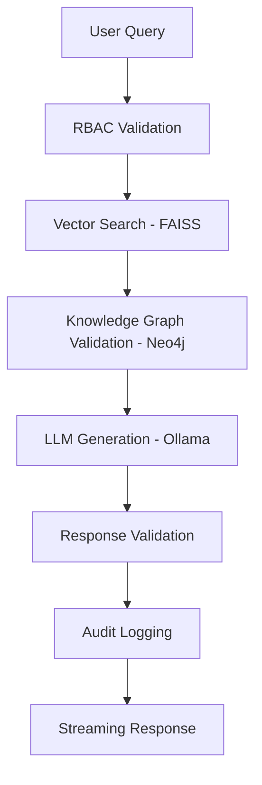

# 🚀 Secure Offline RAG System for ISRO Documents

[](https://python.org)
[](https://fastapi.tiangolo.com)
[](https://neo4j.com)
[](LICENSE)

> A secure, offline, graph-augmented Retrieval-Augmented Generation (RAG) system specifically designed for ISRO domain documents. Combines vector search with knowledge graph validation to minimize hallucinations while enforcing strict role-based access control.

## 🌟 Key Features

- **🔒 Offline-First Security**: Complete air-gapped operation with no external API dependencies
- **🧠 Hybrid Intelligence**: Vector search (FAISS) + Knowledge graph (Neo4j) validation
- **👥 Role-Based Access Control**: Multi-tier security (Scientist, Engineer, Public)
- **📊 Comprehensive Audit Trail**: SQLite-based logging for compliance and monitoring
- **⚡ Real-time Streaming**: WebSocket-based streaming responses
- **🔍 Advanced Validation**: Graph-based fact verification to reduce AI hallucinations
- **📱 Modern Web Interface**: Responsive FastAPI + HTML frontend

## 🏗️ Architecture



## 📁 Project Structure

```
secure-offline-rag/
├── 📁 app/                     # Web Application Layer
│   ├── app.py                  # FastAPI server & API endpoints
│   └── templates/
│       └── index.html          # Frontend interface
├── 📁 backend/                 # Core Business Logic
│   ├── __init__.py
│   ├── ingestion.py           # Document processing & chunking
│   ├── vector_store.py        # FAISS vector operations
│   ├── graph_store.py         # Neo4j graph operations
│   ├── retriever.py           # Hybrid search logic
│   ├── validator.py           # Response validation engine
│   ├── rbac.py                # Role-based access control
│   ├── logger.py              # Audit logging system
│   ├── llm_engine.py          # LLM integration (Ollama)
│   ├── main_engine.py         # System orchestrator
│   ├── session_store.py       # Session management
│   └── populate_db.py         # Database initialization
├── 📁 data/                   # Document Storage
│   ├── isro_docs/             # ISRO PDF documents
│   ├── isro_docs_large/       # Large ISRO documents
│   └── vector_store/          # FAISS indices
├── 📁 logs/                   # System Logs
│   ├── audit_log.db           # SQLite audit database
│   └── sessions.json          # Session storage
├── .env                       # Environment configuration
├── requirements.txt           # Python dependencies
├── main.py                    # CLI document processor
└── test_optimizations.py      # Performance tests
```

## 🚀 Quick Start

### Prerequisites

- **Python 3.8+**
- **Neo4j Desktop** or **Neo4j Community Server**
- **Ollama** (for local LLM inference)
- **Git**

### 1. Clone & Setup

```bash
# Clone the repository
git clone https://github.com/vikaskakarla/Secure-Offline-RAG.git
cd Secure-Offline-RAG

# Create virtual environment
python -m venv .venv

# Activate virtual environment
# Windows
.venv\Scripts\activate
# Linux/Mac
source .venv/bin/activate

# Install dependencies
pip install -r requirements.txt
```

### 2. Configure Neo4j Database

```bash
# Option 1: Neo4j Desktop (Recommended)
# 1. Download Neo4j Desktop from https://neo4j.com/download/
# 2. Create a new Local DBMS
# 3. Set password to 'password' (or update .env file)
# 4. Start the database

# Option 2: Docker
docker run \
    --name neo4j-rag \
    -p 7474:7474 -p 7687:7687 \
    -e NEO4J_AUTH=neo4j/password \
    neo4j:latest
```

### 3. Setup Ollama (Local LLM)

```bash
# Install Ollama
curl -fsSL https://ollama.ai/install.sh | sh

# Pull a model (e.g., Llama 2)
ollama pull llama2
```

### 4. Configure Environment

```bash
# Copy and edit environment file
cp .env.example .env

# Edit .env with your settings
NEO4J_URI=neo4j://127.0.0.1:7687
NEO4J_USERNAME=neo4j
NEO4J_PASSWORD=password
NEO4J_DATABASE=secure_rag
```

### 5. Initialize Data

```bash
# Add your ISRO PDF documents to data/isro_docs/
# Then populate the databases
python -m backend.populate_db
```

### 6. Launch Application

```bash
# Start the FastAPI server
python -m app.app

# Or use uvicorn directly
uvicorn app.app:app --host 127.0.0.1 --port 8000 --reload
```

🎉 **Access the application at:** `http://127.0.0.1:8000`

## 🔐 Authentication & Roles

### Default Credentials
- **Username:** `scientist`
- **Password:** `isro123`

### Role Hierarchy
| Role | Access Level | Permissions |
|------|-------------|-------------|
| **Scientist** | Full Access | All documents, sensitive data |
| **Engineer** | Limited Access | Technical documents only |
| **Public** | Restricted | Public information only |

## 📚 API Documentation

### Core Endpoints

| Method | Endpoint | Description |
|--------|----------|-------------|
| `GET` | `/` | Web interface |
| `POST` | `/login` | User authentication |
| `POST` | `/query` | Process RAG queries |
| `GET` | `/sessions` | List user sessions |
| `POST` | `/sessions/new` | Create new session |
| `GET` | `/sessions/{id}` | Get session details |

### Query API Example

```bash
curl -X POST "http://127.0.0.1:8000/query" \
     -H "Content-Type: application/json" \
     -d '{
       "query": "What are the key features of Chandrayaan-1?",
       "role": "scientist",
       "session_id": "session_123"
     }'
```

## 🛠️ Development

### Running Tests

```bash
# Run optimization tests
python test_optimizations.py

# Run with verbose output
python -v test_optimizations.py
```

### Code Quality

```bash
# Format code
black .

# Lint code
flake8 .

# Type checking
mypy .
```

## 📊 Monitoring & Logging

### Audit Logs
- **Location:** `logs/audit_log.db`
- **Format:** SQLite database
- **Contents:** User queries, responses, validation results, timestamps

### Session Management
- **Location:** `logs/sessions.json`
- **Format:** JSON
- **Contents:** User sessions, conversation history

## 🔧 Configuration

### Environment Variables

| Variable | Description | Default |
|----------|-------------|---------|
| `NEO4J_URI` | Neo4j connection URI | `neo4j://127.0.0.1:7687` |
| `NEO4J_USERNAME` | Neo4j username | `neo4j` |
| `NEO4J_PASSWORD` | Neo4j password | `password` |
| `NEO4J_DATABASE` | Neo4j database name | `secure_rag` |

## 🚨 Troubleshooting

### Common Issues

1. **Neo4j Connection Failed**
   ```bash
   # Check if Neo4j is running
   neo4j status
   
   # Restart Neo4j
   neo4j restart
   ```

2. **FAISS Index Not Found**
   ```bash
   # Rebuild vector store
   python -m backend.populate_db
   ```

3. **Ollama Model Not Available**
   ```bash
   # List available models
   ollama list
   
   # Pull required model
   ollama pull llama2
   ```

## 🤝 Contributing

1. **Fork** the repository
2. **Create** a feature branch (`git checkout -b feature/amazing-feature`)
3. **Commit** your changes (`git commit -m 'Add amazing feature'`)
4. **Push** to the branch (`git push origin feature/amazing-feature`)
5. **Open** a Pull Request

### Development Guidelines
- Follow PEP 8 style guidelines
- Add tests for new features
- Update documentation
- Ensure security best practices

## 📄 License

This project is licensed under the MIT License - see the [LICENSE](LICENSE) file for details.

## 🙏 Acknowledgments

- **ISRO** for providing comprehensive space mission documentation
- **LangChain** community for RAG framework components
- **Neo4j** for graph database technology
- **FastAPI** for modern web framework
- **Ollama** for local LLM inference

## 📞 Support

- **Issues:** [GitHub Issues](https://github.com/vikaskakarla/Secure-Offline-RAG/issues)
- **Discussions:** [GitHub Discussions](https://github.com/vikaskakarla/Secure-Offline-RAG/discussions)
- **Email:** [Contact Maintainer](mailto:your-email@example.com)

---

<div align="center">

**⭐ Star this repository if you find it helpful!**

Made with ❤️ for secure, offline AI applications

</div>
